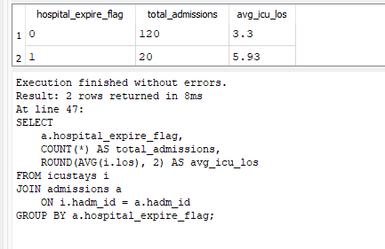

# MIMIC-IV ICU Risk Analytics

Healthcare analytics and ICU risk analysis project using real-world MIMIC-IV clinical data, SQL, Python, SQLite, and healthcare KPI reporting.

---

## Dashboard & Analytics Preview

### Overall Mortality Analysis


---

### ICU Length of Stay Distribution



---

### ICU Unit Analysis


---

### Mortality by ICU Unit


---

### ICU Length of Stay by Mortality


---

### Top Diagnoses Analysis


---

## Project Overview

This project analyzes real-world ICU and hospital admissions data from the MIMIC-IV clinical database.

The project demonstrates:

- Healthcare analytics
- ICU KPI monitoring
- Mortality analysis
- Clinical SQL analytics
- Healthcare data engineering
- Python exploratory data analysis (EDA)
- Healthcare data visualization
- Healthcare business intelligence reporting

---

## Technologies Used

- Python
- SQL
- SQLite
- Pandas
- Matplotlib
- Healthcare Analytics
- MIMIC-IV Clinical Database
- Data Visualization
- Clinical Data Analysis

---

## Clinical Analytics Performed

### ICU KPI Analysis

- Total ICU stays
- Average ICU length of stay
- ICU utilization analysis
- ICU care unit analysis

### Mortality Analytics

- Hospital mortality rate
- Mortality distribution analysis
- Clinical outcome monitoring

### Healthcare SQL Analytics

- Admissions analysis
- Patient analysis
- ICU stay analysis
- Clinical KPI reporting

### Python EDA

- ICU LOS distribution
- Mortality visualization
- ICU unit utilization charts
- Diagnosis trend analysis

---

## SQL Analytics Examples

### Overall Mortality Analysis

```sql
SELECT
    COUNT(*) AS total_admissions,
    SUM(hospital_expire_flag) AS total_deaths,
    ROUND(100.0 * SUM(hospital_expire_flag) / COUNT(*), 2) AS mortality_rate_percent
FROM admissions;
```

### ICU Unit Mortality Analysis

```sql
SELECT
    i.first_careunit,
    COUNT(*) AS total_icu_stays,
    SUM(a.hospital_expire_flag) AS total_deaths,
    ROUND(100.0 * SUM(a.hospital_expire_flag) / COUNT(*), 2) AS mortality_rate_percent
FROM icustays i
JOIN admissions a
    ON i.hadm_id = a.hadm_id
GROUP BY i.first_careunit
ORDER BY mortality_rate_percent DESC;
```

### Top Diagnoses Analysis

```sql
SELECT
    d.icd_code,
    COUNT(*) AS diagnosis_count
FROM diagnoses_icd d
JOIN icustays i
    ON d.hadm_id = i.hadm_id
GROUP BY d.icd_code
ORDER BY diagnosis_count DESC
LIMIT 10;
```

---

## Key Clinical Insights

### ICU Mortality Analysis

Patients with higher ICU length of stay demonstrated increased mortality risk, suggesting prolonged critical care utilization may correlate with severe patient outcomes.

### ICU Unit Performance

Coronary Care Units (CCU) and Neuro Surgical ICU units showed the highest mortality rates among analyzed ICU departments.

### Hospital Utilization Trends

ICU stay distribution analysis identified variability in resource utilization and patient severity across care units.

### Diagnosis Analysis

Top diagnosis categories represented the majority of ICU admissions, highlighting potential areas for operational optimization and risk monitoring.

---

## Repository Structure

```text
mimic-iv-icu-risk-analytics/
│
├── data/
│   ├── raw/
│   └── processed/
│
├── database/
│   └── mimic_icu.db
│
├── outputs/
│
├── screenshots/
│
├── sql/
│   └── icu_kpi_analysis.sql
│
├── src/
│   ├── create_data_subset.py
│   ├── load_to_sqlite.py
│   └── mimic_eda.py
│
├── requirements.txt
│
└── README.md
```

---

## Data Source

MIMIC-IV Clinical Database Demo Dataset:

https://physionet.org/content/mimic-iv-demo/2.2/

---

## Business Use Cases

This project can support:

- ICU operational monitoring
- Healthcare KPI reporting
- Mortality risk analysis
- Hospital resource utilization
- Clinical analytics
- Healthcare business intelligence
- Executive healthcare reporting

---

## Technical Skills Demonstrated

- SQL joins and aggregations
- Clinical KPI analysis
- Healthcare risk analytics
- SQLite database management
- Exploratory Data Analysis (EDA)
- Healthcare data visualization
- Real-world clinical data processing
- GitHub project documentation
- Analytical storytelling

---

## Future Improvements

Planned future enhancements include:

- Predictive mortality modeling
- ICU readmission prediction
- Power BI dashboard integration
- Time-series ICU trend analysis
- Machine learning risk scoring
- Dockerized analytics pipeline
- Automated ETL workflows

---

## Disclaimer

This project uses the publicly available MIMIC-IV Demo dataset for educational and portfolio purposes only.

No protected health information (PHI) is included.

---

## Related Analytics Projects

### Healthcare Executive Dashboard (Power BI)

https://github.com/ag48665/healthcare-executive-dashboard-powerbi

### Hospital Readmission Risk Prediction

https://github.com/ag48665/hospital-readmission-risk-sql-python

### Healthcare Claims Risk Analytics Pipeline

https://github.com/ag48665/healthcare-claims-risk-analytics-pipeline

### SQL Banking & Fraud Analytics Portfolio

https://github.com/ag48665/sql-data-analysis-portfolio

---

## Author

Agata Gabara

Bioinformatics | Healthcare Analytics | SQL | Python | Power BI | Data Analytics | Clinical Analytics

---
